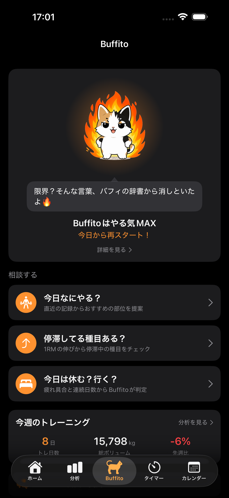
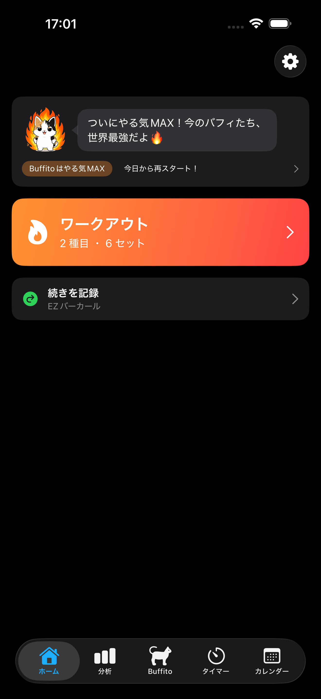
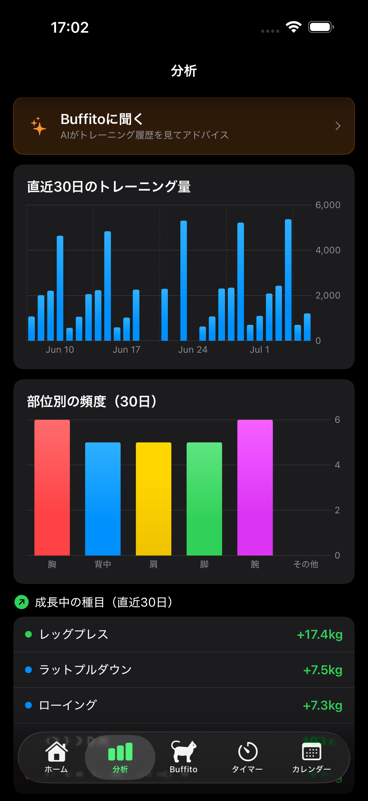

# Buffito — 相棒と続ける筋トレ記録アプリ

<p align="center">
  
  
  
</p>

**「入力が楽で、見た目がカッコよくて、続かない人を支える」** をコンセプトにした iOS 筋トレ記録アプリです。
記録を続けるとキャラクター「Buffito」が喜び、サボると寂しがって闇堕ちする——継続そのものをゲームにしています。

- **状況**：App Store 申請済み（v1.1）／ TestFlight 外部テスト配信中
- **開発期間**：2026年3月〜（個人開発）
- **コード規模**：Swift 約90ファイル + Cloudflare Workers（TypeScript）

## 主な機能

| 分類 | 内容 |
|---|---|
| 記録 | 部位→種目→セット（重量・回数・レスト秒）の3タップ入力、カスタム種目、過去日付の記録 |
| 相棒 | やる気ポイント制で6段階に変化するムード・セリフ、状態遷移コメント、ホーム画面ウィジェット |
| 相談 | 「今日なにやる？」「停滞レスキュー」「休む？行く？」——記録データからローカルで判定 |
| AI | 「Buffitoに聞く」：トレーニング履歴を根拠に次回の重量・回数を提案（Gemini API） |
| 分析 | 推定1RM、成長中/停滞中ランキング、部位別頻度、週次ヒートマップ、自己ベスト検出 |
| タイマー | レストタイマー（リング/画像テーマ）、プリセット、バックグラウンド通知 |
| 継続支援 | ストリーク、ムード連動の通知、PRお祝いバナー、毎日リマインダー |

## 技術スタック

- **iOS**：Swift / SwiftUI / SwiftData / WidgetKit / Swift Charts / UserNotifications（外部ライブラリ不使用・Apple純正のみ）
- **AIバックエンド**：Cloudflare Workers（TypeScript）+ Gemini API + Workers KV（Vitestでテスト）
- **対象**：iOS 17+

```
MuscleApp/                # iOSアプリ本体
├── Models/               # データモデル（@Model / enum）
├── Services/             # 共有ロジック（ムード計算・通知・AI通信など）
└── Views/<機能名>/        # 画面（Home / Buffito / Analytics / Timer / Calendar / Exercise / Settings / AI）
BuffitoWidget/            # ホーム画面ウィジェット（Widget Extension）
buffito-ai-proxy/         # AIプロキシWorker（APIキー秘匿・レート制限）
```

## 設計で工夫したこと

### 1. ムードは「保存しない」——記録から毎回決定的に再計算

キャラクターのやる気（0〜100pt）は、直近30日のトレーニング日から毎回計算します。状態を保存しないため不整合が起きず、**「未来にサボり続けたらどうなるか」も計算できる**のがポイントです。これを利用して：

- **通知**：「3日後に休み続けていたらこのムード」を予測して文面を選ぶ（トレーニングすると全通知が再スケジュールされるため、予測は必ず当たる）
- **ウィジェット**：未来7日分のタイムラインを事前生成。アプリを一度も開かなくても、ホーム画面のBuffitoが日ごとに寂しくなっていく

### 2. AIバックエンドは「クライアントを信用しない」

- Gemini APIキーは端末に置かず、Cloudflare Workers（Secrets管理）で仲介
- 課金状態などのクライアント申告はサーバー側で無視し、レート制限は**デバイス別**と**全体**の二段構え（deviceId偽装によるコスト濫用への非常ブレーキ）
- 入力はメッセージ長・deviceId形式・コンテキストサイズをすべてサーバー側で検証
- AIに送るのはトレーニング数値のみ。氏名等の個人情報は送らず、初回同意後のみ送信

### 3. ウィジェットはデータ本体を共有しない

SwiftDataストアをApp Groupへ移動すると既存ユーザーのデータ移行リスクがあるため、**ムード計算に必要な最小情報（トレ日・ストリーク）だけ**をスナップショットとして共有UserDefaultsに書く設計にしました。ウィジェット側はSwiftData非依存で軽量に保っています。

### 4. 読みやすさを最優先したコード規約

- 1ファイル1View・機能別フォルダ分割・エラーの握りつぶし禁止（必ずログ）・force unwrap禁止・マジックナンバーの定数化
- ライト/ダークモードは5つのセマンティックカラー（`appBackground`等）に集約し、全画面を一括対応
- セリフ・画像・しきい値などの「データ」はロジックから分離（`SpeechBank` / `ImageBank` / `moodThresholds`）し、追加・調整が1箇所で済む構造

## このリポジトリについて

ポートフォリオとして公開しているソースコードです。**コード・画像・キャラクターの再利用、複製、再配布はご遠慮ください**（All rights reserved）。

- APIキー等の秘密情報は含まれていません（Cloudflare Secretsで管理）
- `wrangler.toml` は `wrangler.toml.example` を参照してください

## 連絡先

buffito.app@gmail.com
